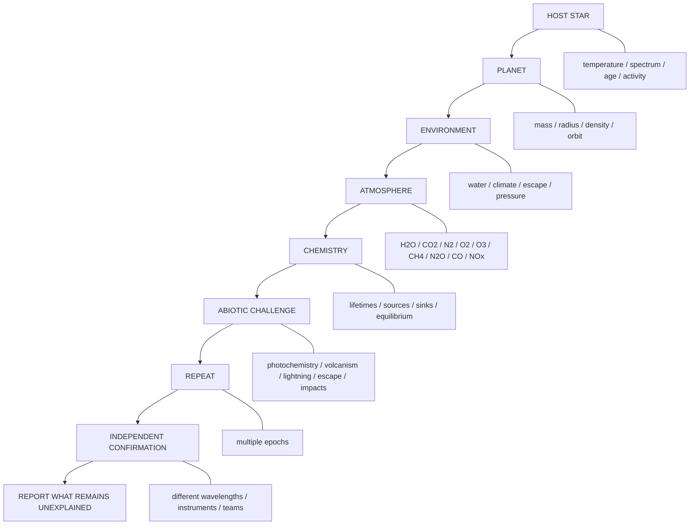

# How to Examine an Exoplanet

## The method

This is the central teaching path for the repository.

## Step 1 — Host star

Measure or constrain the stellar environment before interpreting the planet.

Record:

- Spectral class
- Effective temperature
- Radius and mass
- Luminosity
- Metallicity
- Age
- Rotation
- UV and X-ray environment
- Flare/activity behavior
- Stellar spots and variability
- Time evolution of the stellar radiation environment

**Why first?**

The stellar spectrum drives atmospheric photochemistry. A planetary gas mixture cannot be interpreted correctly without knowing the radiation that is acting on it.

## Step 2 — Planet

Record:

- Mass
- Radius
- Density
- Surface-gravity estimate
- Orbital period
- Semi-major axis
- Eccentricity
- Incident stellar flux
- Equilibrium-temperature estimate
- Transit geometry
- Transit depth and duration, when available

A habitable-zone designation is a starting constraint, not a conclusion about habitability.

## Step 3 — Environment

Determine what can actually be said about:

- Surface temperature
- Atmospheric pressure
- Water vapor
- Clouds and hazes
- Possible surface liquid water
- Atmospheric escape
- Ocean/surface reservoirs
- Climate stability

Do not assume an Earth-like surface merely because the planet is in a habitable zone.

## Step 4 — Atmospheric inventory

Build the molecular inventory before interpreting it.

Core panel:

**H2O, CO2, N2, O2, O3, CH4, CO, N2O, NO, NO2, HNO3, NH3, SO2, H2S**

For each species, record:

- Detection status
- Retrieved abundance or upper limit
- Uncertainty
- Spectral bands
- Instrument
- Observation epoch
- Retrieval/model assumptions

## Step 5 — Chemistry

For each important gas ask:

1. What produces it?
2. What destroys it?
3. How long should it survive?
4. Is a non-biological source capable of replenishing it?
5. What other gases should accompany that source?
6. Is the observed mixture near or far from chemical equilibrium?

### Disequilibrium panel

The most informative result is usually a **combination** of species rather than one molecule.

Examples:

- O2 + CH4
- CO2 + CH4
- N2 + O2 + H2O
- N2O + O2/O3
- CH4 + CO2 + low CO

These combinations must be evaluated with planetary photochemistry and geochemistry.

## Step 6 — Abiotic challenge

Every candidate biosignature receives a competing-explanation test.

Test where physically relevant:

- CO2 photolysis
- H2O photolysis and hydrogen escape
- Volcanic gases
- Serpentinization
- Hydrothermal reactions
- Lightning
- Impacts
- Surface oxidation
- Atmospheric escape
- Stellar UV/XUV-driven chemistry

The standard is not "find a possible abiotic process."

The standard is:

**Can an abiotic model reproduce the observed planetary system quantitatively?**

## Step 7 — Repeat

Prefer:

- Multiple transits
- Multiple observing epochs
- Different instruments
- Different wavelengths
- Independent stellar models
- Independent atmospheric retrievals

A persistent signal is stronger evidence than a single marginal feature.

## Step 8 — Independent confirmation

Whenever practical, seek confirmation by a second instrument, observatory, wavelength range, or analysis team.

## Final report

Every completed target should answer:

- What was measured?
- What remains uncertain?
- What physical environment is supported?
- What chemistry is observed?
- What equilibrium state is expected?
- What abiotic mechanisms were tested?
- Which abiotic explanations survive?
- What observations would discriminate between the remaining hypotheses?

### No life score

The repository does not assign an arbitrary numerical "life score."

The output is an evidence record.

---

## The working Earth question

Earth is the reference case because life is independently established.

The teaching question is not:

> "What gas proves life?"

It is:

> "What complete atmospheric and planetary state does known life maintain, and can an abiotic planet reproduce that state?"

That is the baseline we carry to other worlds.

## Scientific foundation

The structure follows the four-part biosignature assessment logic described by Catling et al.: characterize the stellar/planetary system, characterize habitability, assess biosignatures in environmental context, and exclude false positives.

Primary reference:
https://www.giss.nasa.gov/pubs/abs/ca07620h.html
